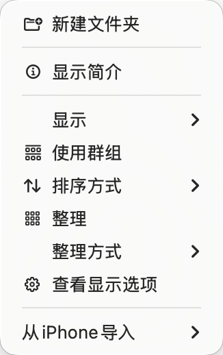

# TermHere

超轻量的 macOS Finder 右键扩展：让 AI 时代的编程更加直达

在访达里右键任意文件夹，瞬间获得：

- **Run in Terminal ▸** —— 一键在当前路径启动 `claude`、`claude --dangerously-skip-permissions`、`codex` 等 AI 终端
- **Open With ▸** —— 一键用 Cursor / VS Code 等 AI IDE 打开当前目录
- **Open Terminal Here** —— 直接开 Terminal，路径已经 `cd` 好了

不用再手动拖拽、`cd` 路径、复制粘贴。从看到代码到 AI 开始工作，只需要一次右键。

所有命令和应用通过 JSON 文件配置，增删预设不需要改代码、不需要重启 Finder。



## 系统要求

- macOS 13 (Ventura) 或更高
- 完整版 [Xcode](https://apps.apple.com/cn/app/xcode/id497799835) 15+（不是 Command Line Tools）
- [XcodeGen](https://github.com/yonaskolb/XcodeGen)：`brew install xcodegen`

## 快速开始

```bash
git clone https://github.com/awsl666wuhu/TermHere.git
cd TermHere
./scripts/install.sh
```

脚本会自动 clean build → 安装到 `/Applications` → 卸载残留注册 → 重启 Finder。重复运行也是安全的，每次都会把扩展注册收敛到 `/Applications/TermHere.app` 这一份。

如果是第一次在本机用 Xcode 命令行，先跑一次：

```bash
sudo xcode-select -s /Applications/Xcode.app/Contents/Developer
sudo xcodebuild -license accept
sudo xcodebuild -runFirstLaunch    # 装一些系统组件，可能要几分钟
```

也可以直接用 Xcode 打开 `TermHere.xcodeproj`，按 ⌘R 运行（开发用）。

> 想看脚本到底干了什么，去 [`scripts/install.sh`](scripts/install.sh) 翻一下，每一步都有注释。

## 启用扩展（首次必做）

1. 启动一次 `TermHere.app`（窗口里点 **"Open Extension Settings…"**，或手动进 系统设置 → 通用 → 登录项与扩展）
2. 找到 **TermHereFinder** 并把开关打开
3. 关闭系统设置；如菜单仍不出现，跑一次 `killall Finder`

## 使用

右键文件夹 / 文件 / 文件夹内空白处 → **TermHere ▸**

顶层（高频）：
- **Open Terminal Here** — 在当前路径开新 Terminal 窗口
- **Copy Path** — 把路径复制到剪贴板（多选则多行）

按类型嵌套的子菜单：
- **Run in Terminal ▸** — 在当前路径运行预设命令，内置 `claude`、`claude --dangerously-skip-permissions`、`codex`，以及三个 Claude 起手 prompt（理解项目 / 审核当前文件 / 解释当前文件）
- **Open With ▸** — 用 Cursor / VS Code / iTerm2 / Warp / Ghostty / Sublime 等打开（仅显示本机已安装的）
- **Move To ▸** — 移动到预设目录（默认为空，按需配置）
- **New File ▸** — 用模板创建新文件（Markdown / Python / Shell）

| 右键位置 | 适用动作 |
|---|---|
| 文件夹 | 全部 |
| 文件 | 全部（Terminal/Run 在父目录） |
| 文件夹内空白处 | 除 Move To 外全部 |
| 多选 | 全部（Move To 移动每个；Copy Path 多行；Terminal/Run 在共同父目录） |

**第一次点击会弹一个对话框**："TermHere Finder Extension 想要控制 Terminal" —— 必须点 **好** / **允许**。这是 macOS 的自动化权限，扩展需要它来给 Terminal 发指令开新窗口。

如果不小心点了"不允许"，到 **系统设置 → 隐私与安全性 → 自动化** 里把 TermHere Finder Extension 下的 Terminal 勾上即可。

## 配置

所有可配置菜单项以 JSON 形式存放在 `~/Library/Application Support/TermHere/`：

```
~/Library/Application Support/TermHere/
├── open-with/      # "用 X 打开"，每个 .json 一项
├── run/            # 在 Terminal 跑命令，每个 .json 一项
├── move-to/        # 移动到目录，每个 .json 一项
└── new-file/       # 文件模板，每个 .json 一项
```

首次启动会自动写入若干预设；之后**编辑或删除都不会被覆盖**。删过的预设要恢复，删除整个 `TermHere` 目录再启动 app 即可重新写入。从主程序点 **"Reveal Config Folder"** 可以直接打开这个目录。

> 注意：写好新 JSON 后右键即可生效，**不需要重启 Finder**；扩展每次打开菜单时都会重新读取磁盘。

### JSON 格式

`open-with/*.json` —— 用某个 app 打开当前路径：
```json
{ "title": "Visual Studio Code", "bundleId": "com.microsoft.VSCode" }
```
- `title`：菜单里显示的名字
- `bundleId`：目标 app 的 bundle identifier（在终端用 `osascript -e 'id of app "Visual Studio Code"'` 可以查到）
- 可选 `"showOnlyIfInstalled": false` —— 默认 `true`，本机没装该 app 时菜单不显示这一项

`run/*.json` —— 在 Terminal 里 `cd` 到当前路径并跑命令：
```json
{ "title": "Claude", "command": "claude" }
```
命令字符串原样交给 shell 执行，可以带参数：
```json
{ "title": "Claude (skip permissions)", "command": "claude --dangerously-skip-permissions" }
```

`command` 字段支持模板变量（与 `new-file/*.json` 一致）：

- `{path}` —— 当前路径（命令已经 `cd` 到这里，通常用不到）
- `{filename}` —— 选中文件的文件名（含扩展名）；空白处右键时为空
- `{name}` —— `{filename}` 去掉扩展名；空白处右键时为空
- `{selection}` —— 全部选中项相对当前路径的路径，已 shell 转义、空格分隔；空白处右键时为空

自定义 prompt 的例子（在 `~/Library/Application Support/TermHere/run/` 里丢一个 JSON 即可）：

```json
{
  "title": "翻译当前文件到英文",
  "command": "claude '请把 {filename} 翻译成英文，保留 Markdown 格式。'"
}
```

想要 codex 或 `claude --dangerously-skip-permissions` 版本的 prompt 预设，照着内置的 `claude-review-file.json` 把 `claude` 换掉即可。

`move-to/*.json` —— 把选中的文件移动到目标目录：
```json
{ "title": "Inbox", "destination": "~/Desktop/_inbox" }
```
`destination` 支持 `~` 展开；目录不存在会自动创建；遇到重名追加 ` 2`、` 3` 后缀。

`new-file/*.json` —— 用模板在当前路径新建文件：
```json
{ "title": "Markdown", "extension": "md", "filename": "Untitled", "content": "# {name}\n\n" }
```
支持的模板变量：
- `{path}` —— 目标目录的绝对路径
- `{filename}` —— 最终文件名（含扩展名，已避免重名）
- `{name}` —— 最终文件名去掉扩展名

> 要添加新项：写一个 JSON 文件丢进对应子目录。要删除内置项：删除对应 JSON 文件。下次右键即可生效。

## 项目结构

```
TermHere/
├── project.yml                       # XcodeGen 配置——工程的唯一真源
├── Presets/                          # 内置 JSON 预设，首次启动写入用户目录
│   ├── open-with/
│   ├── run/
│   └── new-file/
├── docs/
│   ├── specs/                        # 设计文档
│   └── plans/                        # 实现计划
├── TermHere/                         # 主程序（最小 SwiftUI）
│   ├── TermHereApp.swift
│   ├── ContentView.swift
│   ├── ConfigBootstrapper.swift      # 首次启动把 Presets 复制到用户目录
│   └── Assets.xcassets/              # AppIcon
├── TermHereFinder/                   # Finder Sync 扩展
│   ├── FinderSyncController.swift    # FIFinderSync 入口
│   ├── SelectionContext.swift        # 解析选中上下文
│   ├── MenuBuilder.swift             # 构建 TermHere 子菜单（含分隔线 workaround）
│   ├── Action.swift                  # 普通 Action 协议
│   ├── GroupAction.swift             # 带子菜单的 Action 协议
│   ├── ConfigLoader.swift            # JSON 解析 + 模板变量
│   ├── FilenameUtilities.swift       # 文件名冲突处理
│   ├── TerminalLauncher.swift        # AppleScript 启动 Terminal
│   ├── ActionRegistry.swift          # 已注册的动作分组
│   └── Actions/
│       ├── OpenTerminalAction.swift
│       ├── CopyPathAction.swift
│       ├── OpenWithAction.swift
│       ├── RunCommandAction.swift
│       ├── MoveToAction.swift
│       └── NewFileAction.swift
└── TermHereFinderTests/              # 单元测试
```

## 添加新动作（代码层面）

只想加 JSON 预设的话直接编辑 `~/Library/Application Support/TermHere/` 即可。要写新逻辑：

1. 在 `TermHereFinder/Actions/` 下新建 `MyAction.swift`，实现 `Action`（或带子菜单的 `GroupAction`）协议
2. 在 `ActionRegistry.groups` 里把它加进合适的分组
3. 重新构建 —— 新菜单项会自动出现在 `TermHere` 子菜单下

## 故障排查

| 现象 | 排查 |
|---|---|
| 系统设置里没有 TermHereFinder | `pluginkit -m -p com.apple.FinderSync \| grep -i term` 看有没有注册；没有就 `lsregister -f /Applications/TermHere.app` 再 `killall Finder` |
| 系统设置里显示成"文件提供程序" | 旧的错误注册没清掉。`lsregister -u /Applications/TermHere.app` 再 `lsregister -f ...` |
| 系统设置里出现**多个** TermHere | 通常是命令行构建后 `DerivedData` 里的副本也被注册了。卸载它们：`lsregister -u ~/Library/Developer/Xcode/DerivedData/TermHere-*/Build/Products/*/TermHere.app`，再 `killall Finder` |
| 右键看到菜单但点击无反应 | `log stream --predicate 'subsystem == "com.termhere.TermHere.Finder"'` 看日志；多半是 AppleEvents 权限被拒，到 系统设置 → 隐私与安全性 → 自动化 里勾上 Terminal |
| 改了代码重装后还是旧行为 | `tccutil reset AppleEvents com.termhere.TermHere.Finder` 清 TCC 缓存，再重启 Finder |
| 菜单里出现一行横线（`─────`）而非真分隔线 | 这是有意的。Finder Sync 扩展在 IPC 过程中会丢掉 `NSMenuItem.separator()` 的标记，导致原生分隔线变成空白行；为此 TermHere 用一行横线字符模拟分隔线 |

## 卸载

```bash
# 1) 系统设置 → 登录项与扩展 → 关掉 TermHereFinder
# 2) 删除 app 和数据
rm -rf /Applications/TermHere.app
rm -rf ~/Library/Application\ Support/TermHere
tccutil reset AppleEvents com.termhere.TermHere.Finder
```

## 关于代码签名

仓库里所有构建命令默认使用 **ad-hoc 签名**（`CODE_SIGN_IDENTITY="-"`），无需 Apple 开发者账号，本机自用够用。

如果你要分发给别人，建议改用 Developer ID 签名 + 公证（notarization），否则用户首次打开会被 Gatekeeper 拦截。修改 `project.yml` 里的 `DEVELOPMENT_TEAM` 字段并重新生成工程即可。

> ⚠️ 不要在 `xcodebuild` 命令里加 `CODE_SIGNING_REQUIRED=NO CODE_SIGNING_ALLOWED=NO` —— 会让链接器输出 `linker-signed` 弱签名，macOS 的插件系统不认。`CODE_SIGN_IDENTITY="-"` 才是正确的 ad-hoc 方式。

## 许可

MIT
